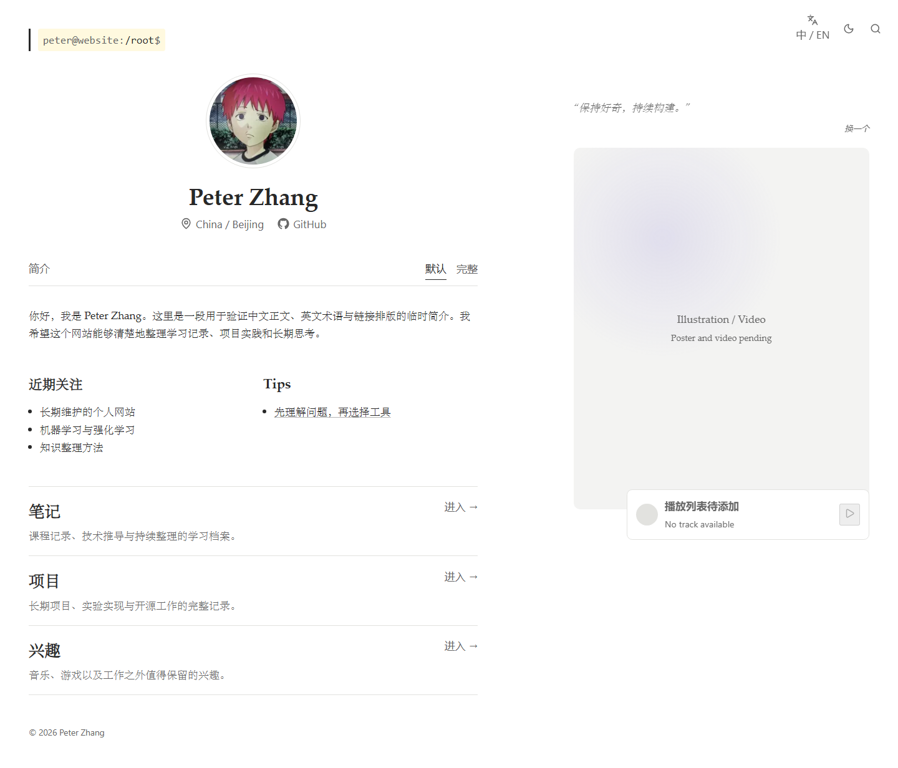
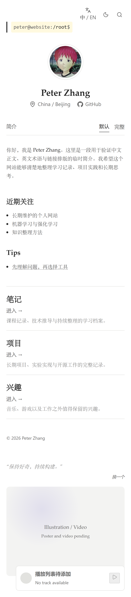
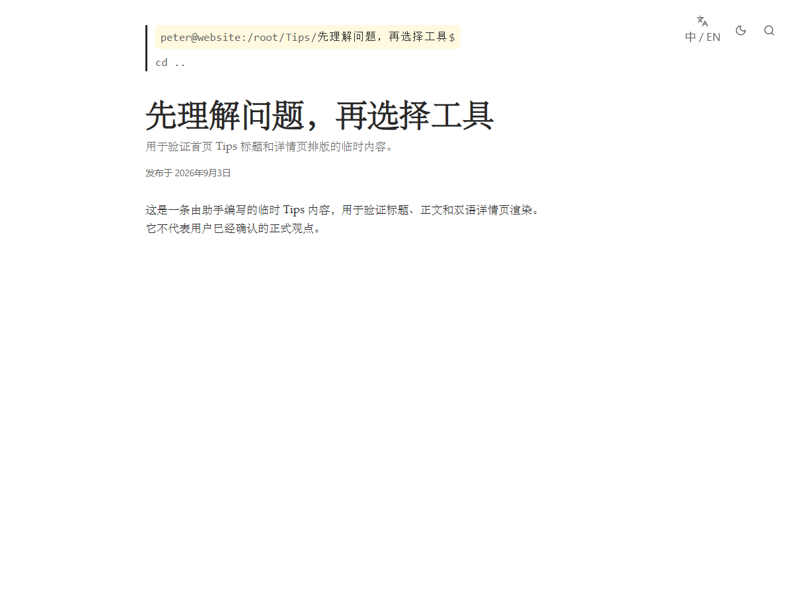

# 视觉与交互系统

## 文档状态

- 当前版本：网站基础版本
- 验收日期：2026-09-04
- 最近变更：2026-09-12 移除音乐播放器（见第 13 节）
- 样式入口：`src/styles/`
- 相关设计：[网站基础版本设计](../design/2026-09-03-website-setup.md)
- 架构说明：[网站架构与维护接口](website-architecture.md)

本文档记录已经验收的界面现状、稳定修改接口和扩展边界。设计来源借鉴 Lee Robinson 与 Arthals' ink 的排版和结构原则，但没有复制其资产、文章或实现代码。

## 1. 视觉方向

当前方向是“编辑式阅读页面 + 一处明确技术符号”。大面积白色或暖黑背景、衬线正文、细分隔线和充足留白构成主体；终端路径是主要辨识符。界面避免普遍的卡片墙、渐变按钮、过度动画和整站终端模拟。

桌面主页最终效果：



移动端最终效果：



Tip 详情页最终效果：



截图使用正式内容源生成；其中的 Bio、Tip、Recent Focus、句子和栏目说明仍是已披露的助手临时排版文字。以上三张截图的拍摄时间早于音乐播放器移除，其中仍包含播放器。

## 2. 设计变量

设计变量集中在 `src/styles/tokens.css`，组件不应重复硬编码整套主题颜色。

### 浅色主题

| 变量 | 色值 | 用途 |
| --- | --- | --- |
| `--bg` | `#ffffff` | 页面背景 |
| `--text` | `#282828` | 正文 |
| `--heading` | `#282828` | 标题与强调文字 |
| `--muted` | `#676767` | 次要信息 |
| `--surface` | `#f3f3f2` | 轻微表面和媒体占位 |
| `--divider` | `#e2e2df` | 分隔线与边框 |
| `--focus` | `#6657c8` | 键盘焦点 |
| `--terminal-highlight` | `#fff9df` | 所有终端路径第一行背景 |

### 深色主题

| 变量 | 色值 | 用途 |
| --- | --- | --- |
| `--bg` | `#1b1a19` | 页面背景 |
| `--text` | `#e8e5df` | 正文 |
| `--heading` | `#f4f1eb` | 标题 |
| `--muted` | `#aaa59e` | 次要信息 |
| `--surface` | `#242321` | 轻微表面 |
| `--divider` | `#3b3936` | 分隔线与边框 |
| `--focus` | `#b7acf5` | 键盘焦点 |
| `--terminal-highlight` | `#302c22` | 所有终端路径第一行背景 |

新增颜色应先判断能否表达为现有语义变量。主题调整必须同时检查正文、链接、焦点、边框、代码和媒体空状态的对比度。

## 3. 字体系统

`--reading` 用于标题和正文：

```css
"Iowan Old Style",
"Palatino Linotype",
Palatino,
Georgia,
"Songti SC",
STSong,
SimSun,
serif
```

`--ui` 用于按钮、元数据、搜索和工具栏；`--mono` 用于终端路径和代码。网站只引用系统已有字体，不分发 Iowan 字体文件。不同平台使用后备字体产生的字形差异是当前接受的维护取舍。

正文基础字号为 `17px`、行高 `1.68`；小于 `560px` 时字号降为 `16px`。头像下的 `Peter Zhang` 使用 `clamp(1.75rem, 3.4vw, 2.35rem)`，保持清晰但不压过头像和正文。

## 4. 布局与断点

全站内容最大宽度为 `1440px`，页面外边距使用 `clamp(1.25rem, 3.2vw, 3rem)`。

主页桌面网格：

```css
grid-template-columns: minmax(0, 1.72fr) minmax(320px, 1fr);
```

左栏最大宽度 `720px`；右栏在桌面 sticky，并使用 `padding-top: clamp(7rem, 14vh, 10rem)` 与右上工具栏拉开距离。右栏内的插画最小高度为 `64vh`。

断点：

- `880px`：主页改为单栏，右侧媒体回到文档流，右栏顶部间距降为 `2.5rem`，插画最小高度改为 `320px`；
- `560px`：增加顶部空间容纳工具栏，Recent Focus/Tips 和栏目入口改为单列。

内容页正文容器最大宽度 `760px`，正文行宽最大 `72ch`。代码和表格只在自身内部横向滚动，不能让整页产生横向滚动。

## 5. 终端路径

组件：`src/components/navigation/TerminalPath.astro`。

路径第一行统一显示 `peter@website:`、分级路径和 `$`，背景贴合文字宽度。浅色背景固定为 `#fff9df`，深色为 `#302c22`。这是全站规则，不只适用于首页。

可点击的祖先层级由 `PathSegment.href` 提供；当前页面没有链接。父级返回 `cd ..` 独占第二行，不带黄色背景。长路径允许换行，真实部署 base `/MyWebsite` 不出现在显示路径中。

修改路径结构时应同步检查：

- `src/lib/content-navigation.ts`；
- `src/components/navigation/TerminalPath.astro`；
- 内容页浏览器测试；
- 移动端长路径换行。

## 6. 个人资料区

组件：`src/components/home/ProfileHeader.astro`。

- 头像由 Astro `Image` 组件生成多尺寸资源；
- 姓名、所在地、GitHub 地址来自 `src/site.config.ts`；
- 地点图标使用 Lucide；
- GitHub 链接使用本地 GitHub Mark 组件 `src/components/icons/GitHubMark.astro`；
- GitHub 在新标签页打开，并使用 `rel="noreferrer"`。

更换头像时替换 `src/assets/profile/avatar.jpg`，并保持清晰的正方形或可安全居中裁切的构图。姓名和链接文字修改应优先改集中配置，不要在组件里复制信息。

## 7. 右上工具栏

组件：`src/components/ui/UtilityToolbar.astro`。

从左到右为语言、主题、搜索。桌面固定在右上角；按钮和链接最小触控尺寸为 `2.5rem`。默认没有永久外框，hover 时使用 `--surface`。图标按钮具有无障碍名称。

语言链接由页面传入：内容有译文时进入对应详情，没有译文时回到目标栏目。主题与搜索由客户端脚本增强。

## 8. Bio 切换

组件：`src/components/home/BioToggle.astro`。

Default 和 Long 采用完整正文替换，不同时并排或展开。状态不持久化，刷新恢复 Default；缺少 Long 内容时不渲染按钮。按钮使用 `aria-pressed` 表达当前状态，Default 内容在无 JavaScript 时仍显示。

新增动画时必须保持克制，并在 `prefers-reduced-motion` 下关闭。Bio 不进入 Pagefind 索引。

## 9. 主题

主题值保存在 `localStorage.theme`，只能是 `light` 或 `dark`。`BaseLayout.astro` 在页面可见绘制前读取该值，减少主题闪烁；读取失败或 JavaScript 不可用时使用浅色。

主题按钮当前显示月亮线性图标，不根据当前状态切换图形。若以后调整图标或增加系统主题，必须重新明确默认规则和持久化迁移方式。

## 10. 搜索

组件：`src/components/search/SearchDialog.astro`。

- 点击搜索图标或按 `Ctrl/Command + K` 打开；
- `Escape` 关闭；
- 关闭后焦点回到触发控件；
- 打开后按需加载 Pagefind 浏览器模块；
- 最多展示 8 条当前语言结果；
- 空输入、无结果和索引不可用都有本地化状态。

搜索对话框使用原生 `<dialog>`。修改结果模板时必须保留键盘可操作性、`aria-live` 状态和当前语言 filter。

## 11. 随机句子

组件：`src/components/media/QuoteRotator.astro`；数据：`src/data/quotes.json`。

句子中英文混排，不随站点语言筛选。当前句子 ID 写入 `sessionStorage`，只在当前标签页保持。中文按钮为“换一个”，位于实际句子右下方。数据为空时显示本地化空状态。

当前实现按数组顺序循环，而不是数学随机抽取。若以后改变算法，应保证不会连续重复，并补充状态测试。

## 12. 插画与视频接口

组件：`src/components/media/IllustrationMedia.astro`。

可传入：

```ts
interface Props {
  poster?: string;
  videoWebm?: string;
  videoMp4?: string;
  alt?: string;
}
```

当前没有正式媒体，显示克制占位。存在视频时，只为桌面宽度、精细指针且未请求 reduced motion 的用户提供 source；悬停约 200ms 后播放，移出暂停并复位。播放错误不会移除 poster。

正式封面优先放在 `src/assets/`；需要稳定 URL 的视频放在 `public/media/illustration/`。不得使用未授权素材。

右栏主页由 `src/components/media/PersonalMedia.astro` 组合随机句子与插画两件。

## 13. 音乐播放器（已移除）

音乐播放器于 2026-09-12 移除，右栏不再包含任何播放控件。用户明确要求删除，并选择连同数据层一并清理。

删除内容：组件 `src/components/media/MusicPlayerShell.astro`、数据 `src/data/music.json`、`src/lib/local-data.ts` 中的 `musicSchema` 与 `loadMusic()`、`src/styles/global.css` 中的 `.player` 与 `.player__disc`、文案键 `playlistPending`，以及 `public/media/audio/` 占位目录。

`docs/requirements/2026-09-03-website-setup.md` 中“右下角可收缩音乐播放器”一条仍保留在需求文档里（需求文档由用户所有，不因实现变动而改写），但当前明确不在实现范围内。将来若要恢复，需要重新建立 schema、数据文件和浏览器测试，不能假定旧接口仍然存在。

详细变更清单与回归证据见 [`docs/records/2026-09-12-remove-music-player.md`](../records/2026-09-12-remove-music-player.md)。

## 14. 文章排版

文章样式位于 `src/styles/prose.css`：

- Shiki 提供浅色与深色代码主题；
- 代码块有边框、内部滚动和复制按钮；
- 行内代码使用独立暖红色；
- GitHub 风格提示块使用克制表面和类型标签；
- 表格在窄屏内部滚动；
- KaTeX 块公式允许横向滚动；
- 日期和 Project 元数据使用系统无衬线字体。

内容页面的 `description` 位于主标题下方。普通 Markdown 图片最大宽度为容器宽度并保持纵横比。

## 15. 可访问性与动效规则

- 全站使用 `:focus-visible` 提供明显焦点；
- 页面提供跳转到主内容链接；
- 纯图标按钮必须有 `aria-label`；
- 搜索状态使用 `aria-live`；
- Bio 使用 `aria-pressed`；
- `prefers-reduced-motion: reduce` 关闭非必要平滑滚动和过渡；
- 视频在 reduced motion 与移动端不下载；
- 颜色不能作为唯一状态表达。

任何视觉修改都应至少检查一个桌面和一个移动端视口；涉及交互时同时使用键盘验证。
